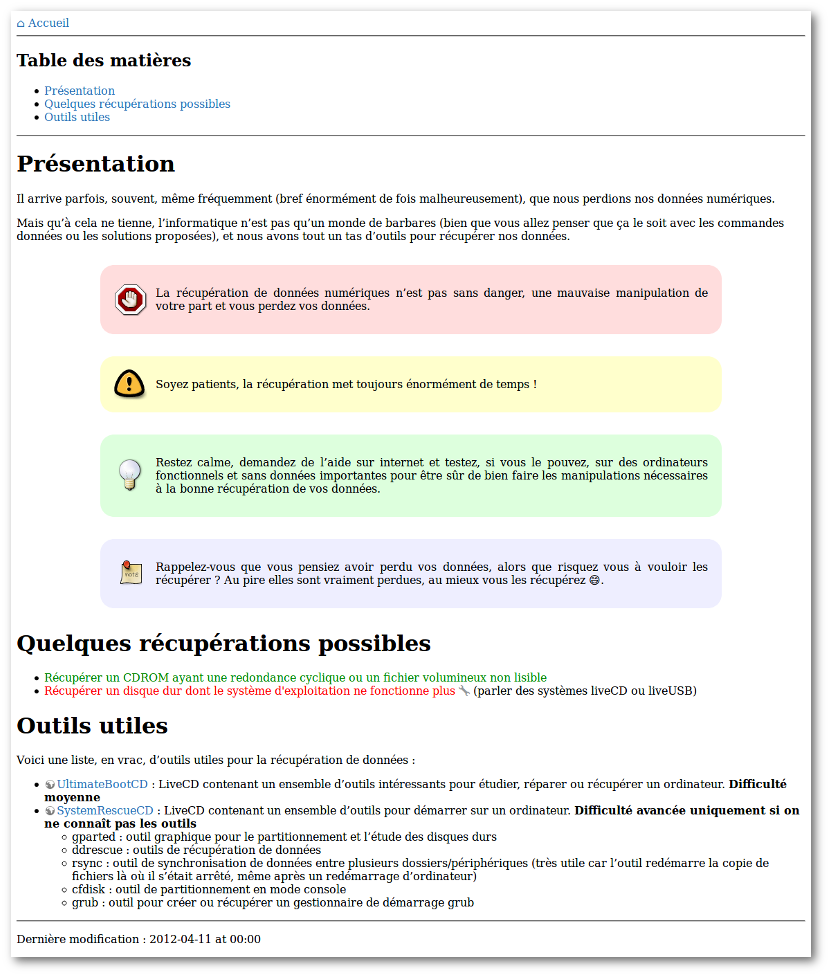

# Adam & Eve

I migrated my [Dokuwiki](https://www.dokuwiki.org/) to [Hugo](http://gohugo.io/) and created a new theme reconcile both: Adam & Eve was born.

This theme is special: it comes with it more simple formal dress.

So I only give some elements so that you can create a Wiki.

After that, you need to dress it with more CSS.

# Link behaviour in content

For more information about shortcodes, check [Shortcode section](#shortcodes).

## Behaviour 1 (default): all links are internal one and you will use remote shortcode

By default all links are blue (table of contents, menu, etc.). And all links from the content are green (as internal one).

This mean you will probably use 'remote' shortcode for external links.

Indeed you can use 'internal' shortcode too. But all links from main content is green by default.

## Behaviour 2: all links are normal and you will use internal and remote shortcode to define all links

If you want to consider all links as normal, and want to define yourself which link is external, which other one is internal, you need to comment these line in **static/css/main.css**:

```
main a:active, main a:link, main a:visited, main a:hover {
 color: #080; // comment this line if you planned to use 'internal' shortcode
}
```

Add **//** at the beginning of each line will be enough.

# Shortcodes

To use wiki functionnalities, I create some shortcodes.

## nolink

Display a word you want to use later to create a new page of your Wiki.

In Dokuwiki it was CamelCase behaviour that show you a word in red.

Example:

```

```

## remote

Display a link with a globe before so that readers know they will go away your wiki.

Example:

```

```

**Optional**: This shortcode accepts a third parameter to define link title. Example: 

```

```

## internal

This shortcode will use `relref` Hugo command to create a relative link to the given page.

```

```

## note

Display a sidebar with a specific background color to show readers something important.

We have 4 sidebar models:

  * warning (red)
  * important (yellow)
  * tip (green)
  * normal (blue)

Example:

```
{}
Pay attention to read this **entire page** before applying what you read!
{}
```

# Screenshots

This is a single page from the wiki, showing:

  * a simple menu to go to the homepage
  * a table of contents
  * internal shortcode (the green link)
  * note shortcode (the 4 models)
  * nolink shortcode (the red link)
  * remote shortcode (the link with a globe before)


